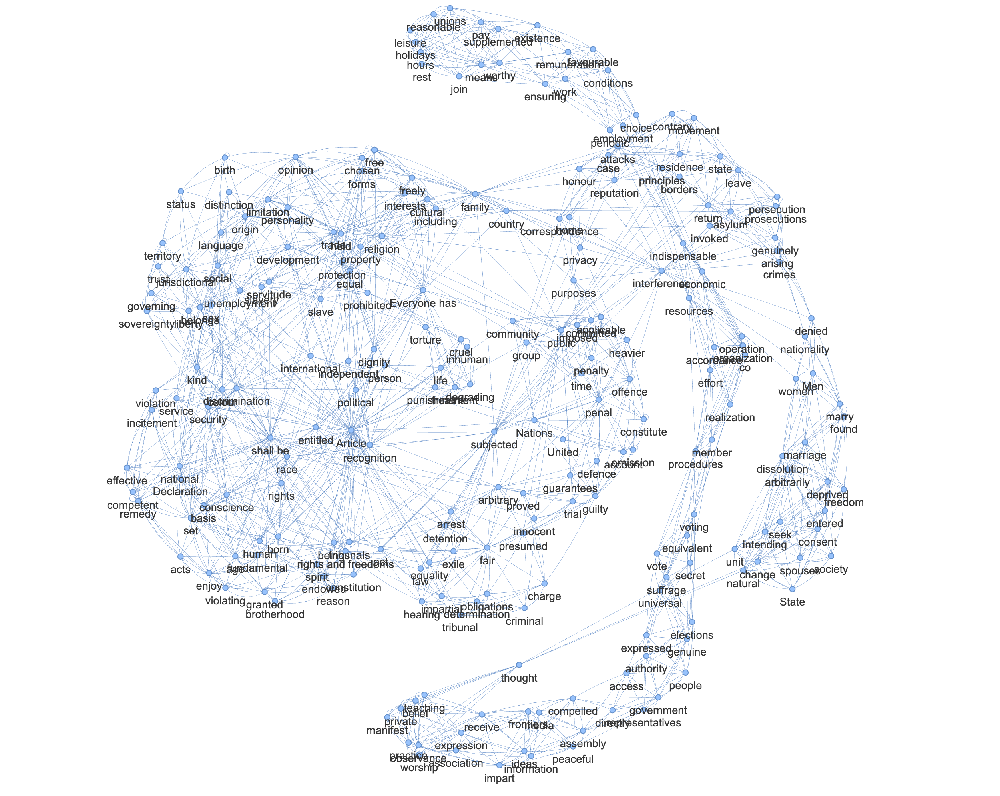

# Textplot

This repository contains an extended version of David McClure's `textplot` package, which is a tool for visualizing the structure of a text document. It uses kernel density estimation to create a network of terms based on their co-occurrence in the document.

## What's New?

In this version, we've added the following features:

- Text preprocessing with [SpaCy](https://spacy.io/): The text is tokenized and lemmatized using SpaCy, which allows us to benefit from its advanced NLP capabilities and support for multiple languages. Currently, the package supports English, German, French, and Italian, but you can easily add support for other languages by installing the appropriate SpaCy model and updating the code.
- Phrase detection: The package now includes a phrase detection feature based on [Gensim](https://radimrehurek.com/gensim/models/phrases.html) that allows you to identify and visualize multi-word expressions in the text. This is particularly useful for analyzing texts with complex terminology or idiomatic expressions.
- Filtering by part-of-speech: The package now allows you to filter the terms included in the network based on their [UPOS](https://universaldependencies.org/u/pos/) tags. This can help you focus on specific types of words, such as nouns or verbs, and improve the quality of your analysis.
- Support for multiple input formats: The package now supports multiple input formats, including a single plain text file, a directory of files and a pre-loaded list of strings.

## Setup

To install the package, clone the repository and install the required dependencies:

```bash
# Clone the repository
git clone git@github.com:liri-uzh/textplot.git
cd textplot

# Create a virtual environment and install the dependencies

# If you have `uv` (https://github.com/astral-sh/uv) installed, you run
uv venv --python 3.11 --seed
source .venv/bin/activate
uv pip install -r requirements.txt

# Otherwise, you can run use conda or any other virtual environment manager, e.g.
conda create -n textplot python=3.11
conda activate textplot
pip install -r requirements.txt

# Install the language models for SpaCy
python -m spacy download en_core_web_sm
python -m spacy download de_core_news_sm
python -m spacy download fr_core_news_sm
python -m spacy download it_core_news_sm
```

## Usage

To construct a network from a corpus input (a single text file, a directory of files), use the `helpers.py` script:

```bash
python -m textplot.helpers \
    data/corpora/human_rights.txt \
    --tokenizer spacy \
    --lang en \
    --allowed_upos NOUN \
    --stopwords textplot/data/stopwords.txt \
    --phrase_min_count 6 --phrase_threshold 0.6 \
    --bandwidth 2000 --term_depth 200 --skim_depth 5 -d \
    --output_dir data/outputs
```

By default, this will create 3 output files in the output directory:
- `<network>.gml`: The network in GML format, which can be opened with [Gephi](https://gephi.org/).
- `<network>.html`: An interactive HTML file with the network visualization built with `pyvis`.
- `<network>.graphml`: The network in GraphML format (XML).

Note, make sure to replace `data/corpora/human_rights.txt` with the path to your text file or directory of files. 

An example of the resulting network with `pyvis` is shown below:



For a full list of options, run `python -m textplot.helpers --help`.

## TODOs

- [ ] pre vs. post filtering for POS, key terms, sudo words etc.
- [ ] add support for sudo words (these are words that need to be kept for the analysis, but are ultimately visualised in the network)
- [ ] re-scoring and filtering with TF-IDF (needs document boundaries or reference corpus)
- [x] intermediate output of .gml files for networkx
- [x] remove numbers from outputs
- [ ] improve visualisations with [forceatlas](https://github.com/bhargavchippada/forceatlas2) or post-hoc processing with [gephi](https://gephi.org/)

## Acknowledgements

Textplot is the work of David McClure, who created the original version of the package. 

The extended version was developed by LiRI at UZH and is based largely on David's work. We would like to thank him for making his code available to the community.

Texplot uses **[numpy](http://www.numpy.org)**, **[scipy](http://www.scipy.org)**, **[scikit-learn](http://scikit-learn.org)**, **[matplotlib](http://matplotlib.org)**, **[networkx](http://networkx.github.io)**, and **[clint](https://github.com/kennethreitz/clint)**.
